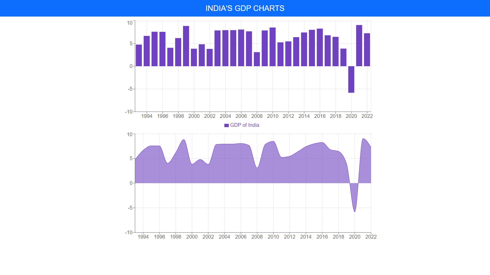

<div align="center">

# India-GDP-Visualisation-Chart✨

[](https://app.netlify.com/sites/india-gdp-visualisation-chart/deploys)

## ✨ [Live Preview](https://india-gdp-visualisation-chart.netlify.app/)

<div align='center'>


</div>

# ⚡Tech Used

<div align="center">
    
</div>

## 🚀 Getting Started

Clone the project

```bash
  git clone https://github.com/darshangaikwad4114/India_GDP_Visualisation_Chart.git
```

Go to the project directory

```bash
  cd India_GDP_Visualisation_Chart
```

Install dependencies

```bash
  npm install
```

Start the server

```bash
  npm run start
```

## ✊ Show your support

Give a ⭐️ if this project helped you!

# 📝License

[](https://github.com/darshangaikwad4114/India_GDP_Visualisation_Chart/blob/main/LICENCE)

# 🙌🏻 Feedback

If you have any feedback, please reach out to us at --> darshangaikwad4114@gmail.com

</div>
